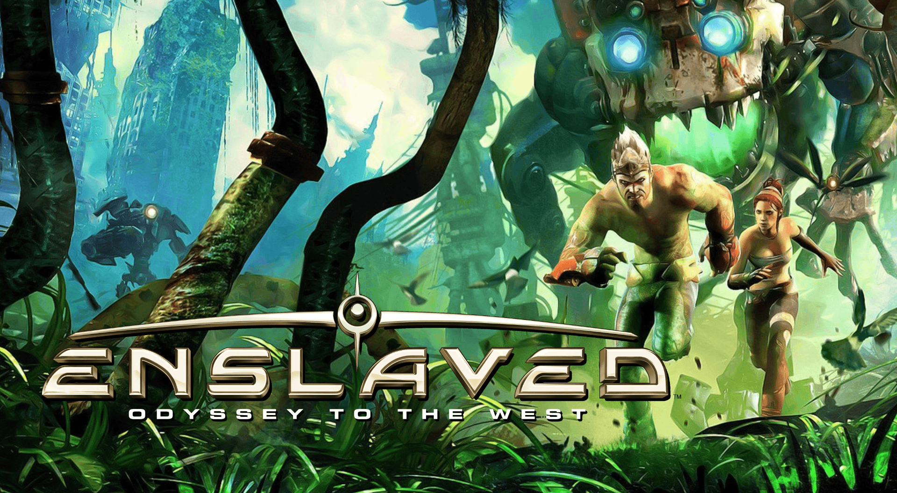

# RPCS3-Artwork

Icon and compilation screen artwork for [RPCS3](https://rpcs3.net) that replaces the official game icons and compilation screens, as well as the Pixelmator templates used to make them.    Compilation screens are only included where the ones that shipped with the game were not very good.

The icons are all 1920x1056 and the compilation screens are 1920x1080. 

## Icons

